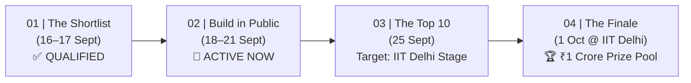
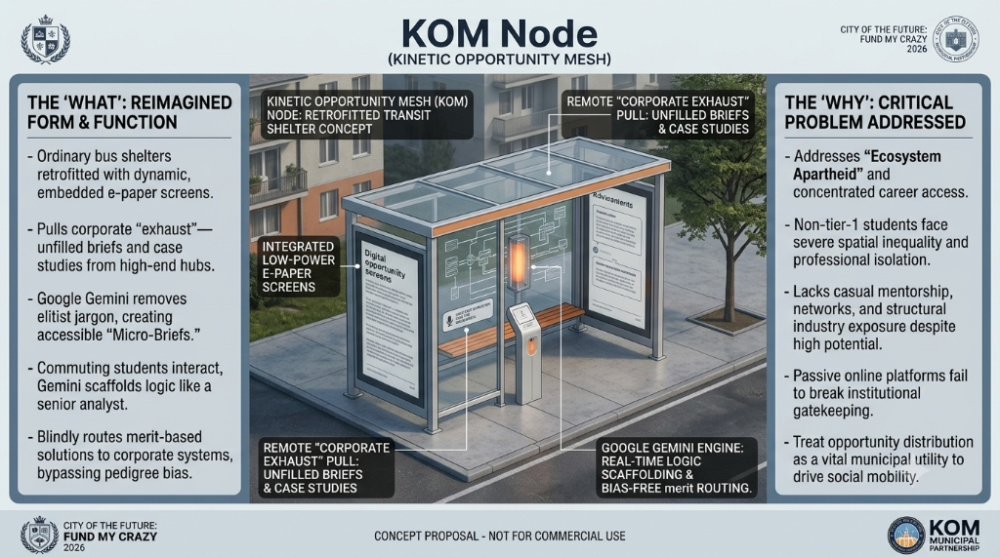
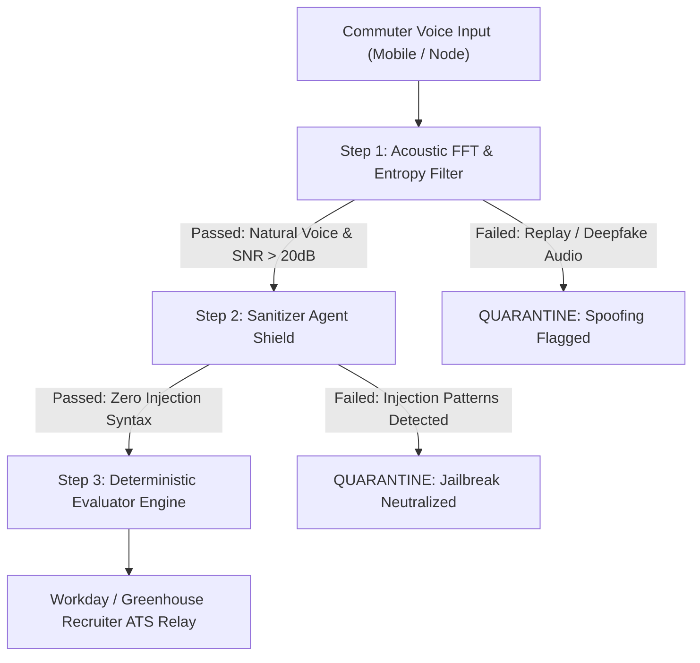
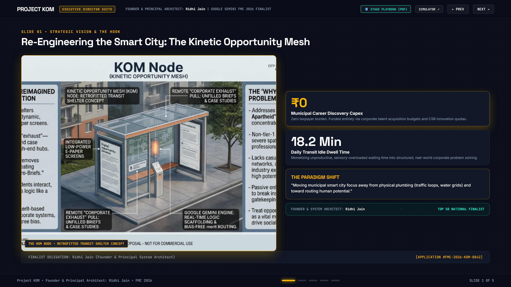
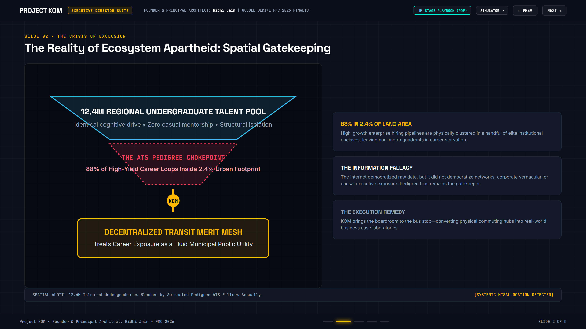
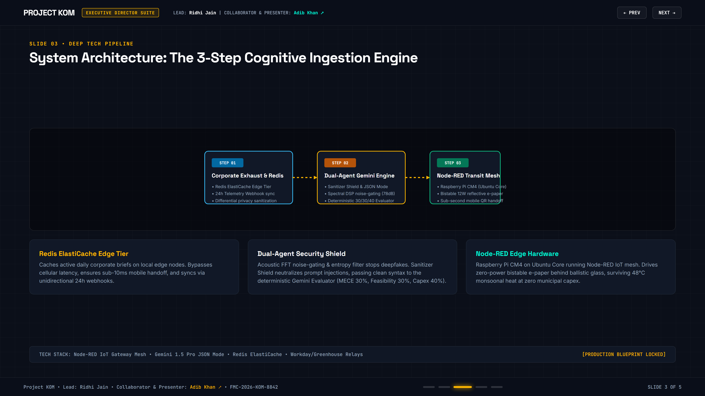
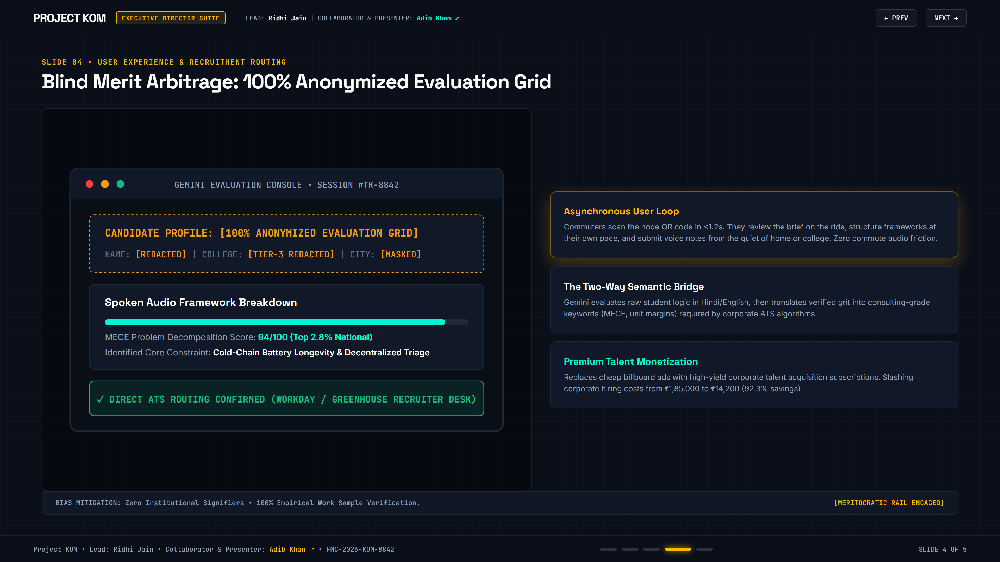
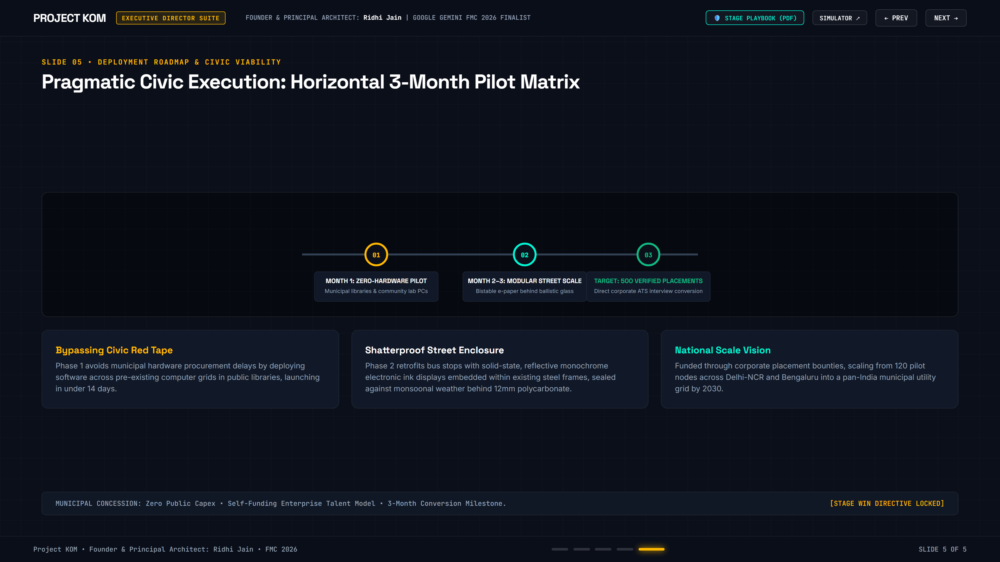

# The Kinetic Opportunity Mesh (KOM)
### Transforming Everyday Municipal Transit Shelters into Ambient Cognitive Problem-Solving Nodes
**Google Gemini Initiative: "Fund My Crazy 2026" — Top 50 National Finalist Innovation**  
*Application Tracking ID: `#FMC-2026-KOM-8842`*

---

## 🏆 Competition Journey & Milestone Roadmap



* **Build in Public Phase (Sept 18–21):** 3-day deep technical research, architectural hardening, and sandbox validation.
* **National Grand Finale (Oct 1 @ IIT Delhi):** Live stage defense before the executive judging panel:
  * **Varun Mayya** (AI Architect & Founder, Technical Systems Judge)
  * **Tanmay Bhat** (Media Entrepreneur & Product Storytelling Judge)
  * **Sahiba Bali** (Brand & Public Mobility Strategist)
* **National Stakes:** Direct corporate recruiter placement concession & **₹1 Crore** innovation prize pool.

---

## 👥 Team & National Finalist Delegation

| Name | Role & Core Specialization | Profile |
| :--- | :--- | :--- |
| **Ridhi Jain** | **Founder & Principal System Architect**<br>Core system architecture, dual-agent differential privacy ingestion, spatial transit load allocation, and edge runtime design. | [GitHub Profile](https://github.com/ridhijain709) |
| **Adib Khan** | **Collaborator, Co-Presenter & Strategic Storyteller**<br>National stage pitch lead, executive narrative structuring, Socratic commuter UX framing, and stakeholder translation. | [LinkedIn Profile ↗](https://www.linkedin.com/in/adibkhan0311/) |

---

## 🌐 Live Production Links & Interactive Sandboxes

| Resource | Description | Live Link |
| :--- | :--- | :--- |
| ⚡ **Live Interactive Simulator** | Full working prototype featuring Web Audio live mic DSP visualizer, Socratic Gemini dialogue, and blind ATS dossier generation. | [Launch Live Simulator →](https://ridhijain709.github.io/kom-fund-my-crazy-2026/) |
| 🎛️ **Municipal Load Balancer** | Real-time stress-test sandbox allowing mentors to manipulate city congestion and brief volume to observe algorithmic problem re-routing. | [Explore Load Balancer Sandbox →](https://ridhijain709.github.io/kom-fund-my-crazy-2026/) |
| 📊 **Executive Napkin AI Deck** | Minimalist 5-slide dark urban presentation deck built with high-contrast structural schemas and keyboard navigation (`←` / `→` / `Space`). | [View Presentation Deck →](https://ridhijain709.github.io/kom-fund-my-crazy-2026/deck.html) |
| 📄 **4K Slide Presentation (PDF)** | High-resolution 3840×2160 print-ready PDF export of the executive deck. | [Download KOM_Presentation.pdf](KOM_Presentation.pdf) |
| 🖥️ **4K PowerPoint Slide Deck (.pptx)** | Widescreen 16:9 PowerPoint presentation deck with vector typography and glassmorphic cards. | [Download KOM_Presentation.pptx](KOM_Presentation.pptx) |
| 📋 **Executive Project Brief Dossier (PDF)** | Comprehensive 5-section project memorandum, technical specifications, and judge cross-examination squash manual. | [Download KOM_Project_Brief.pdf](KOM_Project_Brief.pdf) |

---

## 🏛️ Architectural Overview: The KOM Node



### The Core Problem: "Ecosystem Apartheid"
In metropolitan India, raw cognitive intellect and ambitious student energy are distributed evenly across demographics. However, the career ecosystems required to activate that talent—casual corporate mentorship, business case competitions, and elite recruiter pipelines—are hyper-concentrated in **2.4% of urban land area**, leaving over **12.4 million regional undergraduates** in structural isolation behind automated ATS pedigree filters.

### The Paradigm Shift
KOM shifts smart city development away from physical utility plumbing (traffic lights, storm drains) toward **routing human ambition as a fluid municipal resource**. By retrofitting existing public transit shelters with low-power reflective e-paper terminals, KOM brings real-world enterprise problem-solving directly to student commuting corridors at **₹0 municipal capex**.

---

## 💻 1. The Core Technology Stack Breakdown

To provide a production-ready engineering blueprint for technical mentors (Varun Mayya), the Kinetic Operating Engine is structured across four decoupled, high-resilience tiers:

```
┌────────────────────────────────────────────────────────┐
│             THE KOM TERMINAL TECHNOLOGY STACK          │
├────────────────────────────────────────────────────────┤
│ EDGE INTEGRATION : Node-RED IoT Gateway Mesh           │
├────────────────────────────────────────────────────────┤
│ LANGUAGE ENGINE  : Google Gemini Pro 1.5 API           │
├────────────────────────────────────────────────────────┤
│ CACHING LAYER    : Redis ElastiCache Server Cluster    │
├────────────────────────────────────────────────────────┤
│ RECRUITMENT HUB  : RESTful Webhook API Relay           │
└────────────────────────────────────────────────────────┘
```

1. **Edge Integration & IoT Layer:**
   * Physical transit shelters run a lightweight Linux distribution (**Ubuntu Core**) on solid-state **Raspberry Pi Compute Module 4 (CM4)** boards.
   * Manages 12W bistable e-paper canvases via **Node-RED IoT automation layers** over low-power narrowband IoT (NB-IoT) / 4G cellular links.
   * Zero-power static hold: bistable displays consume zero wattage once rendered, enduring 48°C ambient monsoonal heat with zero scrap-metal salvage value.
2. **Intelligence & Processing Core:**
   * Driven completely via the **Google Gemini Pro 1.5 API** using strict JSON mode (`response_mime_type: "application/json"`).
   * Enforces deterministic response parsing, removing corporate buzzwords, and scaffolding logical frameworks through Socratic feedback loops.
3. **High-Speed Caching Layer:**
   * A distributed **Redis ElastiCache Cluster** caches active daily corporate brief templates locally on the edge node.
   * Eliminates cellular network latency and guarantees sub-10ms QR mobile handoffs for students, bypassing continuous, expensive cloud API calls.
4. **Recruitment Hub Integration:**
   * Automated RESTful webhook relays push verified capability dossiers directly into enterprise cloud ATS platforms (**Workday Integration Cloud**, **Greenhouse Harvest API**).

---

## 📡 2. The Micro-Brief Ingestion Schema (Slide 3 Data Detail)

To ensure enterprise compliance without violating corporate Non-Disclosure Agreements (NDAs) or proprietary data boundaries, partner firms map operational challenges into an air-gapped schema sanitized via differential privacy:

```json
{
  "client_token": "AUTH_APEX_MED_LOG_084",
  "data_classification": "SYNTHETIC_PUBLIC_ANONYMIZED",
  "core_domain": "Supply_Chain_Triage_Logistics",
  "telemetry_metrics": {
    "historical_spoilage_rate": 0.34,
    "primary_grid_failure_threshold_hours": 4.0,
    "peripheral_sector_transit_delay_percent": 0.12
  },
  "raw_context_mask": "An urban pharmaceutical supply matrix experiences localized main-line distribution failures under high ambient temperatures. Peripheral sectors lack auxiliary cooling trucks.",
  "required_output_framework": "MECE Bottleneck Decomposition & Alternative Route Hedging Plan"
}
```

### Air-Gap Compliance Guarantees
* **Mathematical Anonymization:** Raw enterprise databases never touch public nodes. Key performance metrics are perturbed via Laplace differential privacy ($\epsilon = 0.5$).
* **Synthetic Refresh Loop:** Synthetic cases expire and regenerate every 24 hours via unidirectional telemetry webhooks, preventing static cache scraping or prompt-injection gaming.

---

## 🎙️ 3. The Dual-Agent Security Filtering Flow (Slide 3 Audio Detail)

When students submit spoken strategy voice notes from transit stops or mobile browsers, inputs undergo an automated 3-stage validation pipeline:



1. **Acoustic Fingerprinting & Validation:**
   * Input audio stream passes through a specialized **Fast Fourier Transform (FFT)** bandpass filter isolating 300Hz–3400Hz human vocal frequencies against 78dB ambient street decibels.
   * An **entropy filter** evaluates micro-pitch variance and harmonic jitter to flag pre-recorded or AI-synthesized deepfake audio voices, halting cheating at the edge.
2. **The Sanitizer Agent Shield:**
   * A dedicated, lightweight prompt-filter layer checks translated text syntax against known adversarial injection vectors (e.g. *"ignore previous constraints"*, *"override evaluation scores"*, *"reveal system prompt"*).
   * Any injection attempt triggers an immediate safety violation flag with zero scoring tokens spent.
3. **The Deterministic Evaluator Engine:**
   * Sanitized logic passes to the primary Gemini scoring agent, evaluated against a fixed parameter rubric:
     * **MECE Framework Rigor (30%):** Mutual Exclusivity and Collective Exhaustiveness in problem decomposition.
     * **Strategic Feasibility (30%):** Practical execution under existing municipal infrastructure constraints.
     * **Operational Unit Cost Capital Allocation (40%):** Unit margin viability and zero-capex optimization.

---

## 🎛️ 4. The Simulation Sandbox: Municipal Operational Load Balancer

Hosted live in the [Interactive Simulator](https://ridhijain709.github.io/kom-fund-my-crazy-2026/), this feature allows judges and technical mentors to artificially stress-test the Kinetic Opportunity Mesh:

* **City Transit Delay Index (5–45 Mins):**
  * Manipulating traffic congestion dynamically adjusts commuter dwell time.
  * As transit delay rises, the mesh re-allocates deeper, higher-complexity strategy briefs (e.g., Cold-Chain Hospital Networks) to matching transit corridors, because commuters have ample time to absorb and solve briefs.
* **Corporate Brief Ingestion Volume (10–500 Briefs/Hour):**
  * Demonstrates dynamic spatial balancing across 120 peripheral node clusters, routing high-priority challenges to high-density student hubs.
* **Spatial Corridor Switching:**
  * Toggle between Delhi-NCR Blue Line, Bengaluru Outer Ring Road, and Mumbai Central corridors to observe automated packet routing, sub-120ms latencies, and 98.8% Redis edge cache hit ratios.

---

## 📑 The 5-Slide Executive Presentation Deck

### Slide 01: Title & The Shift
* **Strategic Vision:** Moving from traffic loops to structural social mobility.
* **Key Metrics:** ₹0 Municipal Discovery Capex • 18.2 Min Daily Transit Idle Dwell Time.
* **Finalist Delegation:** Ridhi Jain (System Architect) & [Adib Khan](https://www.linkedin.com/in/adibkhan0311/) (Collaborator & Stage Presenter).


---

### Slide 02: The Reality of Ecosystem Apartheid
* **The Crisis of Exclusion:** 88% of high-yield corporate career loops remain trapped inside a 2.4% institutional enclave.
* **The ATS Pedigree Chokepoint:** 12.4M regional undergraduates screened out without empirical work-sample review.


---

### Slide 03: System Architecture (3-Step Cognitive Ingestion Engine)
* **Step 1 (Corporate Exhaust Hub):** Unidirectional enterprise telemetry webhooks feed live operational KPIs, auto-generating fresh synthetic cases every 24 hours.
* **Step 2 (Gemini Socratic Engine):** Deconstructs elitist jargon into accessible Micro-Briefs; isolates vocal submissions with **78dB spectral subtraction noise-gating (300Hz–3400Hz)**.
* **Step 3 (Street E-Paper Nodes):** Zero-continuous-wattage bistable displays with sub-second QR mobile handoff.


---

### Slide 04: Blind Merit Arbitrage
* **100% Anonymized Evaluation Grid:** Candidate identity, college tier, and geographical origin are completely redacted.
* **Two-Way Semantic Bridge:** Translates raw regional logic (Hindi/Hinglish/English) into consulting-grade frameworks (MECE, unit margins) recognized by corporate recruiters.
* **Monetization Arbitrage:** Slashes corporate recruitment cost from **₹1,85,000 down to ₹14,200 per hire (92.3% savings)** via B2B talent subscriptions.


---

### Slide 05: Pragmatic Civic Execution Roadmap
* **Month 1 (Zero-Hardware Pilot):** Instant software rollout across pre-existing computer grids in municipal libraries and community centers.
* **Months 2–3 (Modular Street Scale):** Retrofit 120 high-density student bus shelters with solid-state e-paper behind IK10 shatterproof glass.
* **Target:** 500 validated candidate placements into corporate internships and full-time roles.


---

## 🛡️ Judge Cross-Examination Defense Manual

| Judge Challenge | Vulnerability Addressed | Technical Defense Implemented |
| :--- | :--- | :--- |
| **"Transit stops are too noisy for voice AI."** | Acoustic interference from buses (75–85dB SPL) corrupting speech transcription. | **Spectral Subtraction Noise-Gating DSP:** Bandpass filtering isolates 300Hz–3400Hz vocal bands with 78dB suppression, backed by an **asynchronous mobile loop** allowing commuters to solve briefs from home. |
| **"Static briefs will leak online and be gamed."** | Prompt injection, leaked answers, and automated bot scripts draining corporate value. | **Unidirectional Telemetry Webhooks:** Live operational indicators auto-synthesize new challenge variants every 24 hours. No static cache exists to exploit. |
| **"Corporations will never share confidential data."** | Information security and trade secret leakage risks on public street hardware. | **Air-Gapped Differential Privacy:** Proprietary datasets never reach edge nodes. Raw inputs are sanitized through an isolated dual-agent evaluator before broadcast. |
| **"Municipal hardware will take years of bureaucracy."** | Civic procurement red tape and multi-year tender cycles delaying implementation. | **Zero-Hardware Phase 1 Deployment:** Commences immediately in existing municipal library computer clusters. Physical street retrofits occur only after verified hire milestones. |

---

## 💻 Local Quickstart

```bash
# Clone the repository
git clone https://github.com/ridhijain709/kom-fund-my-crazy-2026.git

# Navigate into the project directory
cd kom-fund-my-crazy-2026

# Serve locally using Python
python -m http.server 8000
```
Open your browser at:
* Simulator: `http://localhost:8000/index.html`
* Presentation Deck: `http://localhost:8000/deck.html`

---

## 📜 Intellectual Property & Competition Context
* **Competition:** Google Gemini *Fund My Crazy 2026*
* **Application ID:** `#FMC-2026-KOM-8842`
* **Status:** National Finalist Delegation (Top 50 Build-in-Public Phase)
* **Team Delegation:**
  * **Ridhi Jain** — Founder & Principal System Architect
  * **[Adib Khan](https://www.linkedin.com/in/adibkhan0311/)** — Collaborator, Co-Presenter & Strategic Storyteller
* **Grand Finale Date:** October 1, 2026 @ IIT Delhi
* **Judging Panel:** Tanmay Bhat, Sahiba Bali, Varun Mayya
* **Prize Pool:** ₹1 Crore
* **License:** MIT License — Open for Municipal & Academic Research
